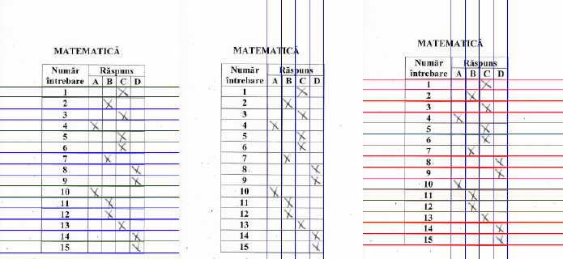
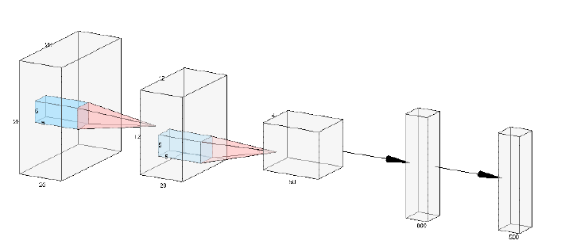
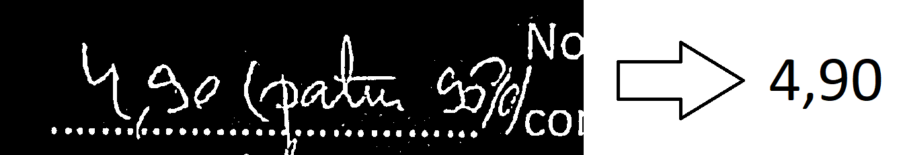
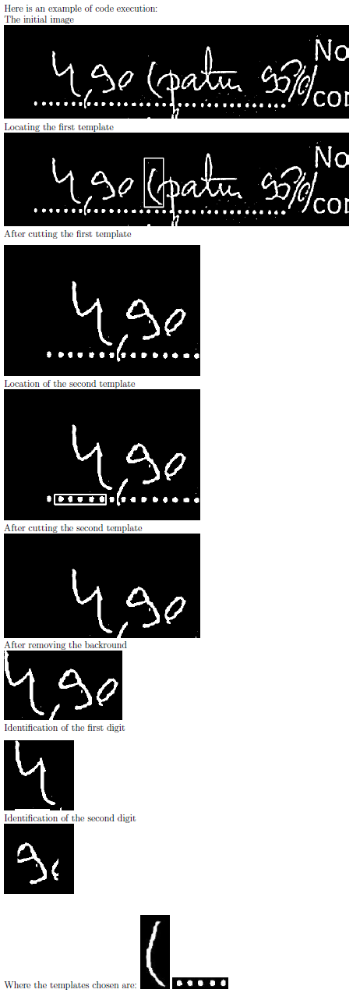

# Automatic grading of multiple choice tests

## Objective
The goal of this project is to develop an automatic system for grading multiple choice tests completed by candidates during the admission exam for the Computer and Information Technology specialization at the Faculty of Mathematics and Computer Science, University of Bucharest.

## Tasks
The job is to write a program in Python that automatically grades an image containing a test sheet.
- Scenario 1 (real world) - you receive a test set containing 55 scanned images annotated with the option (F or I) and with the digit (1, 2, 3 or 4). For each image you have to output the corresponding grade.
- Scenario 2 (intermediate) - you receive a test set containing 50 rotated and 50 perspective images annotated with the view (rotated or perspective), the option (F or I) and the digit (1, 2, 3 or 4). For each image you have to output the corresponding grade. 
- Scenario 3 (no annotations) - you receive a test set containing 75 images (scanned, rotated or perspective view). There is no annotation available. For each image you have to output the corresponding grade. 
- (bonus) Scenario 4 (handwritten recognition) - your receive a test set containing 25 scanned images. We will make sure to modify some content such that the grade written in red to be different that the grade obtained by a perfect grading system. For each image you have to output the corresponding handwritten grade.

### Scenario 1 (real world)
This task is reduced to identifying the lines and columns in the two tables filled with answers (Xs) on both the left and right sides. For line identification, the find rows (grayscale image) function, which receives a grayscale image of a patch in the image, which contains one of two tables (either blood or right), filters the image with a Sobel filter of y direction. Following this filtering, adding the binarized image and ready on the y axis gives high values in the
way where there are lines. Eliminating the redundant and land lines the last 16 lines get the desired rows, it hurts at the top we have the header of the table that we are not interested in. Of course, the parts that do not contain useful information for this task are removed from the image, ie the writing below and the header, including the variant and the option. The function find columns (grayscale image) does the same thing fixed in the x direction, obtaining the desired columns. 
 
The function find table (grayscale image) calls the two functions described above and then cuts the image in the first row, the last row the first column and the last column, resulting in the area of interest (the one with Xs). Here the most interesting function is find x (grayscale image, vertical lines, horizontal lines) iterates along the lines and calculates the average of the pixels in the patch delimited by vertical lines (ie 4 means, A, B, C, D) and then selects in response for the respective row (ie the number in the subject) the patch index with the smallest value (the one with the most black => has X).

The predict grade scenario 1 (path, subject, number) function loads the image from the path, eliminates the redundant parts, cuts it in two, determines the delimiting lines and columns on each side, then identifies the student's Xs on both the left and right with d x function. Next, knowing the subject and the number, I load the correct answers (the scale) and then begin to compare the answers with the answers (A, B, C, or D). **For this task, the accuracy of the 150 images is 100%.**

### Scenario 2 (intermediate)
Scenario 2 can be reduced very elegantly to Scenario 1 using a hemography matrix that reduces an image with a subject in perspective or rotation to a desired template. For this function transform rotaded and perspective in scanned (img path, template path) transforms the image from img path into one that looks like a template from template path. Initially identify 15000 keypoints with ORB from both the template and the desired image. Then the
matches are identified in the two-way between keypoints, the first 50% of these matches are selected, referring to the Hamming distance. Finally, the hemography matrix is identified and the image reduced to the template.

Next a principle identical to Scenario 1 is hypothetically correct. But as an optimization, because the warp image (reduced to the template has noise compared to the template) identifies the lines and columns on the template (no noise and stable) to be used on the image reduced to the template (with noise and more). stable). In the absence of these optimizations the accuracy for this scenario is about 90% and at present it is 100%. I mention that for perspective, rotated or scanned this principle is used.

### Scenario 3 (no annotations)
For this scenario we will use the detect subject choice (choice patch grayscale, rows, cols) function that identifies the Informatica and Physics boxes in an image knowing the lines and columns (the edges are known to be above the first line and between the last two columns of the right-hand side) . Being in this Scenario we do not know neither the subject nor the number of the subject we will need some additional tools. To identify the subject is
simple: with the function of earlier, the boxes are identified then the boxes are sorted by the y coordinate and if box 1 has an average of pixels larger than box 2 then it is Informatica otherwise Physics.
 
To identify the number is a little trickier. We will need the eval patch (patch) function and a model (a convolutional network trained on MNIST). The convolutional network trained on the MNIST is described in the picture above, and receives as input images of size 28x28. We have variables ranging from 80 to 100 on 80-100. For preprocessing we have: GaussianBlur with 7 x 7 filter for noise elimination, adaptiveThreshold to binarize the image, bitwise not to deny it (in MNIST is white figure on black background), then cut 5 pixels from all edges (corresponding to the figure box) then add 10 pixels on each edge (because in MNIST the figures have little edge) finally resize the image to 28 x 28 and pass it to the network.

Only output indexes 1, 2, 3 and 4 (possible variants in us) are kept from the output activa- tions. At this time the accuracy on labels 2 and 3 is 100%, for 4 of 96% and for 1 of 50% (confusing only with label 4), because the number 1 from us differs considerably from the number 1 from the MNIST. **Accuracy in this scenario is 95%.**

### Scenario 4 (handwritten recognition)
 
This scenario is the most difficult because it involves locating the figures in the image. Next, the approach involves a series of steps: identifying the global area (with lots of background noise) in which the handwritten notes are located.
Then transform the image into grayscale, filter the image with a Gaussian Blurr filter of size 11x11, binarize and finally deny it to be similar to the MNIST format. Then with a series of templates the image is cut in different areas. It then removes the background from all areas with the cut background
(image, proj) function (which from the image received as a column parameter until it no longer finds columns that are sufficiently black (max. 5 white pixels) that are grouped in batches of 10 columns minimum).
Finally, the functions for detecting the whole part of the note and the first decimal are called. Where predict first digit (image) cuts the first half of the image on the x-axis, then changes the cropped image in MNIST style, white to black, squares it, resizes it, and then passes it through the network. The result is network prediction. Where predict second digit (image, pred1) cuts the second part from the image without 15%, then does the same thing
as the whole part prediction function. The only difference is that the result is conditioned by the first prediction: if the first prediction is 9 then the second one can only be 1, 4 or 7. The result will be the index with the largest activation of the possible activations, defined previously. **Accuracy for this scenario is 40%**.
